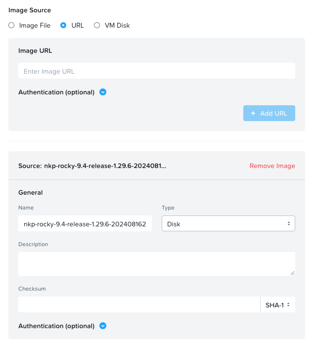
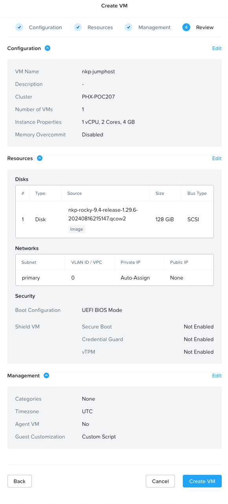

# Harbor VM - Quickstart Guide

## Table of Contents

1. [Overview](#overview)

1. [Prerequisites Checklist](#prerequisites-checklist)

1. [Deploy Linux Harbor host](#deploy-linux-harbor-host)

1. [Install Harbor](#install-harbor)

## Overview

Harbor (https://goharbor.io/) is a registry service.
This guide provides a quick and easy way to deploy an harbor instance using the Rocky Linux image provided by Nutanix in the [Nutanix Support Portal](https://portal.nutanix.com/page/downloads?product=nkp).

## Prerequisites Checklist

To create harbor VM:

- Internet connectivity
- Add NKP Rocky Linux to Prism Central. **DO NOT CHANGE** the auto-populated image name

    <details>
    <summary>click to view example</summary>
    
    </details>


## Deploy Linux Harbor host

1. Connect to Prism Central

1. Create a virtual machine

    - Name: harbor
    - vCPUs: 2
    - Memory: 4
    - Disk: Clone from Image (select the Rocky Linux you previously uploaded)
    - Disk Capacity: 128 (default is 20)
    - Guest Customization: Cloud-init (Linux)
    - Custom Script:
        copy content from this file : [cloud-init](./cloud-init)

    <details>
    <summary>click to view example</summary>
    
    </details>

1. Power on the virtual machine

## Install Harbor

1. Connect to your jump host using SSH (default password: nutanix/4u)

    ```shell
    ssh nutanix@<jump host_IP>
    ```

1. Install Harbor with the command:

    ```shell
    git clone https://github.com/vEDW/nkp-harbor-vm.git
    cd nkp-harbor-vm.git
    
    ```


    

## Support and Disclaimer

These code samples are intended as standalone examples. Please be aware that all public code samples provided by Nutanix are unofficial in nature, are provided as examples only, are unsupported, and will need to be heavily scrutinized and potentially modified before they can be used in a production environment. All such code samples are provided on an as-is basis, and Nutanix expressly disclaims all warranties, express or implied. All code samples are © Nutanix, Inc., and are provided as-is under the MIT license (<https://opensource.org/licenses/MIT>).
